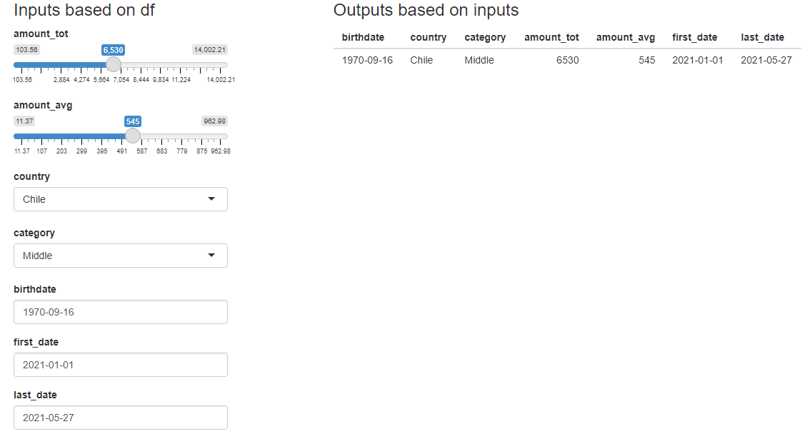

```{r setup, include=FALSE}
knitr::opts_chunk$set(message=FALSE, warning=FALSE)
```

# shinymatic 

<!-- badges: start -->

[](https://lifecycle.r-lib.org/articles/stages.html#experimental)

<!-- badges: end -->

The goal of **{shinymatic}** :package: is to automatically generate shiny inputs based on a dataframe.

## Installation

You can install the development version of **{shinymatic}** from [GitHub](https://github.com/) with:

```{r, eval=FALSE}
# install.packages("devtools")
devtools::install_github("karbartolome/shinymatic")
```

## Example

This is a basic example which shows you how to solve a common problem.

```{r}
library(shiny)
library(shinymatic)
```

For this example, **random customer data** is used. This dataset is included in the package, together with the shinymatic::customers_data() function used to generate the data frame for a number of observations.

```{r}
df <- shinymatic::customers
```

**Data structure:** the data frame includes numeric, factor and date variables.

```{r, echo=FALSE}
str(df)
```

A user interface (UI) is generated. This is a UI for a simple example. It includes 2 columns:

\- Column 1: Inputs generated based on the variables of the dataframe

-   **shinymatic::autoinput_numerical()**: generates the numerical inputs

-   **shinymatic::autoinput_categorical()**: generates the categorical inputs

-   **shinymatic::autoinput_date()**: generates the date inputs

\- Column 2: Text output for the values selected

```{r}
ui <- shiny::fluidPage(fluidRow(
  h1('A shiny inputs example'),
  column(3,
    h3('Inputs based on df'),
    autoinput_numerical(.df = df),
    autoinput_categorical(.df = df),
    autoinput_date(.df = df)
  ),
  column(3,
    h3('Outputs based on inputs'),
    verbatimTextOutput(outputId = 'values')
  )
))
```

Server that generates the reactive output based on each individual input. This is an example to show how the input values can be selected by input id. These values could be used as parameters of an API call.

```{r}
server <- function(input, output) {
  output$values <- reactive({
    paste0(sapply(
      names(df),
      FUN = function(i)
        paste(i, "=", input[[i]])
    ),
    collapse = '\n')
  })
}
```

Shiny app is generated based on the ui and server:

```{r, eval=FALSE}
shiny::shinyApp(ui = ui, server = server)
```

```{r, echo=FALSE, out.width='70%', fig.align='center'}
knitr::include_graphics('man/figures/autoinputs.png')
```

# Auto inputs and auto outputs

All the inputs can be generated with a single function: **shinymatic::autoinputs()**.

```{r, eval=FALSE}
ui <- shiny::fluidPage(fluidRow(
 column(3,
        h3('Inputs based on df'),
        autoinputs(.df=customers)
 ),
 column(3,
        h3('Outputs based on inputs'),
        tableOutput(outputId = 'data_test')
 )
))
```

Also, a dataframe based on the inputs can be easily generated with **shinymatic::autooutput_df()**.

```{r, eval=FALSE}
server <- function(input, output) {
   data_preds <- reactive({
     autooutput_df(.df=customers, .inputs=input, .dates_as_str=TRUE)
   })
   output$data_test <- renderTable ({
     data_preds()
   })
}
```

Notice that **autooutput_df()** generates a dataframe with types Date, numeric and character. However, **renderTable()** only outputs numeric and character data types. That's why **autooutput_df()** includes a **.dates_as_str** parameter. If this function is used to get the correct values, it should be used with .dates_as_str=FALSE (default).

```{r, eval=FALSE}
shiny::shinyApp(ui = ui, server = server)
```

```{r, echo=FALSE, out.width='70%', fig.align='center'}

```

# **Additional comments**

The package idea was influenced by this stackoverflow question: [Shiny Modules: Handling a list of buttons](https://stackoverflow.com/questions/40038749/r-shiny-how-to-write-loop-for-observeevent). All feedback is welcomed!
