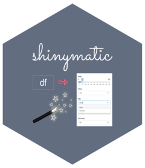
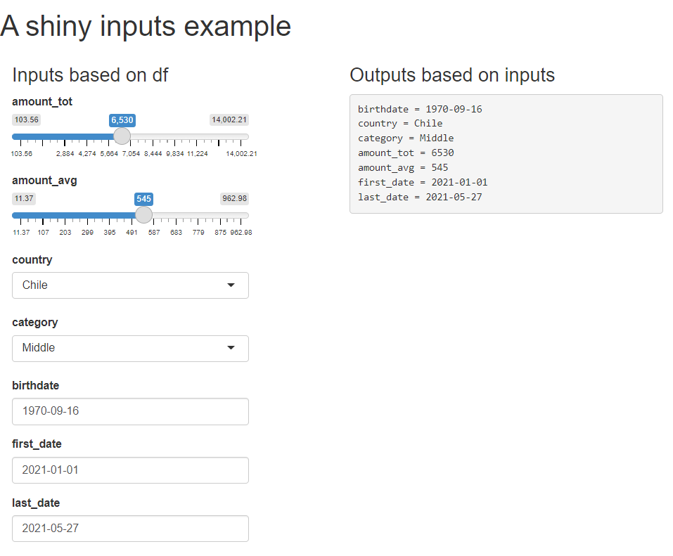

# shinymatic 


<!-- badges: start -->
<!-- badges: end -->

The goal of shinymatic is to automatically generate shiny inputs based
on a dataframe.

## Installation

You can install the development version of shinymatic from
[GitHub](https://github.com/) with:

``` r
# install.packages("devtools")
devtools::install_github("karbartolome/shinymatic")
```

## Example

This is a basic example which shows you how to solve a common problem:

``` r
library(shiny)
library(shinymatic)
library(dplyr)
```

Data:

``` r
load('data/df.rda')
```

Data structure:

    ## 'data.frame':    10 obs. of  9 variables:
    ##  $ id        : num  1 2 3 4 5 6 7 8 9 10
    ##  $ birthdate : Date, format: "1993-02-08" "1986-04-20" ...
    ##  $ type      : chr  "regular" "regular" "regular" "lost" ...
    ##  $ education : Factor w/ 3 levels "1","2","3": 1 2 1 3 1 3 1 1 3 2
    ##  $ country   : chr  "argentina" "argentina" "uruguay" "brasil" ...
    ##  $ first_date: Date, format: "2022-02-01" "2021-05-10" ...
    ##  $ last_date : Date, format: "2022-06-07" "2022-05-10" ...
    ##  $ category  : Factor w/ 2 levels "high","low": 1 2 1 2 2 2 1 1 1 2
    ##  $ total     : num  3457 500 10000 15 40 ...

User interface that includes

``` r
ui <- shiny::fluidPage(fluidRow(
  h1('   A shiny inputs example'),
  column(3,
    h3('Inputs based on df'),
    autoinput_numerical(.df = df),
    autoinput_categorical(.df = df),
    autoinput_date(.df = df)
  ),
  column(3,
    h3('Outputs based on inputs'),
    verbatimTextOutput(outputId = 'cat_values'))
))
```

Server that generates the reactive output based on each individual
input:

``` r
server <- function(input, output) {
  output$cat_values <- reactive({
    paste0(sapply(names(df),
                  FUN=function(i) paste(i,"=", input[[i]])),
           collapse = '\n')
  })
}
```

Shiny app is generated based on the ui and server:

``` r
shiny::shinyApp(ui = ui, server = server)
```


