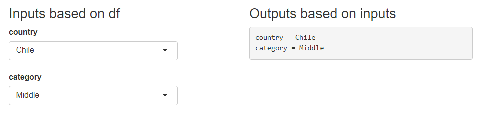
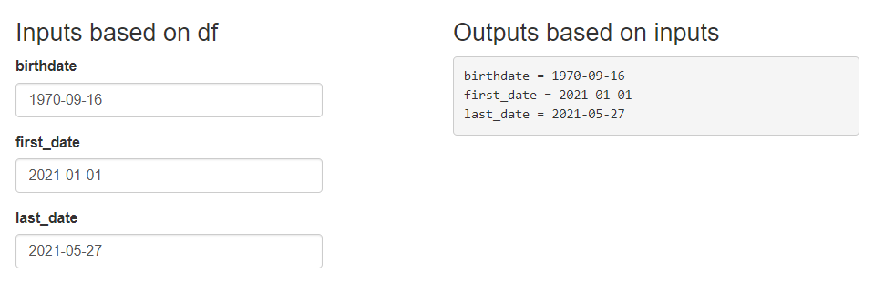

```{r, include = FALSE}
knitr::opts_chunk$set(
  collapse = TRUE,
  comment = "#>"
)
```

```{r setup}
library(shiny)
library(shinymatic)
```

# Numeric inputs

A simple user interface is defined. It includes 2 columns:

- Column 1: Numeric inputs generated from the numeric variables on the dataframe

- Column 2: Text output for the values selected

```{r}
ui <- shiny::fluidPage(fluidRow(
  column(3,
    h3('Inputs based on df'),
    autoinput_numerical(.df = customers)
  ),
  column(3,
    h3('Outputs based on inputs'),
    verbatimTextOutput(outputId = 'values')
  )
))
```

The server side of the app includes the reactive values for each input. This is an example to show how the input values can be selected by input id. These values could be used as parameters of an API call. 

```{r}
server <- function(input, output) {
  output$values <- reactive({
    paste0(sapply(
      names(customers)[sapply(customers, is.numeric)],
      FUN = function(i)
        paste(i, "=", input[[i]])
    ),
    collapse = '\n')
  })
}
```

Finally, the shiny app is generated:

```{r, eval=FALSE}
shiny::shinyApp(ui = ui, server = server)
```

```{r, echo=FALSE, out.width='70%', fig.align='center'}
knitr::include_graphics('figures/autoinput_numeric.png')
```


# Categorical inputs

Considering the factor variables, a new shiny app is generated:

- Column 1: Categorical inputs generated from the factor variables on the dataframe

- Column 2: Text output for the values selected

```{r}
ui <- shiny::fluidPage(fluidRow(
  column(3,
    h3('Inputs based on df'),
    autoinput_categorical(.df = customers)
  ),
  column(3,
    h3('Outputs based on inputs'),
    verbatimTextOutput(outputId = 'values')
  )
))
```

The server side of the app includes the reactive values for each input:

```{r}
server <- function(input, output) {
  output$values <- reactive({
    paste0(sapply(
      names(customers)[sapply(customers, is.factor)],
      FUN = function(i)
        paste(i, "=", input[[i]])
    ),
    collapse = '\n')
  })
}
```

Finally, the shiny app is generated:

```{r, eval=FALSE}
shiny::shinyApp(ui = ui, server = server)
```

```{r, echo=FALSE, out.width='70%', fig.align='center'}

```


# Date inputs

Considering the Date variables, a new shiny app is generated:

- Column 1: Date inputs generated from the Date variables on the dataframe

- Column 2: Text output for the values selected

```{r}
ui <- shiny::fluidPage(fluidRow(
  column(3,
    h3('Inputs based on df'),
    autoinput_date(.df = customers)
  ),
  column(3,
    h3('Outputs based on inputs'),
    verbatimTextOutput(outputId = 'values')
  )
))
```

The server side of the app includes the reactive values for each input:

```{r}
server <- function(input, output) {
  output$values <- reactive({
    paste0(sapply(
      names(customers)[sapply(customers, class) == "Date"],
      FUN = function(i)
        paste(i, "=", input[[i]])
    ),
    collapse = '\n')
  })
}
```

Finally, the shiny app is generated:

```{r, eval=FALSE}
shiny::shinyApp(ui = ui, server = server)
```

```{r, echo=FALSE, out.width='70%', fig.align='center'}

```